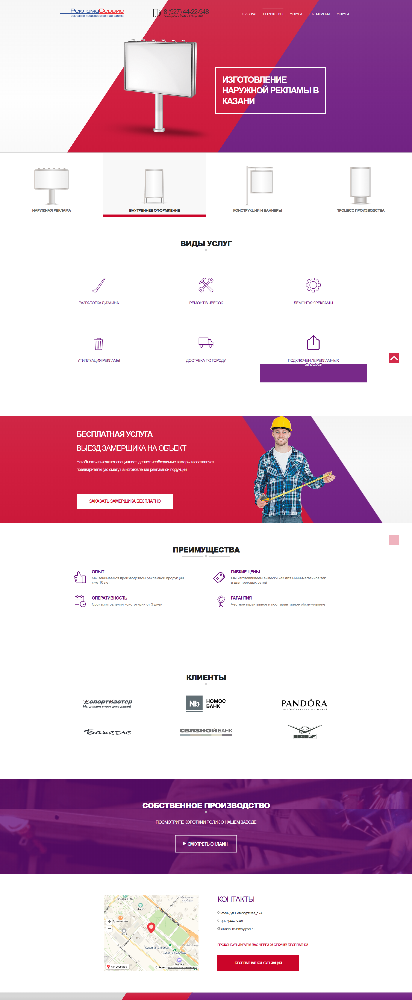

# Рекламма сервис

## What technology I use in the project:

 - npm, gulp
 - sass, reset.css, flexbox, animate.css, css-hamburgers
 - jquery, jquery.maskedinput, validate, pushy
 - yandex map
 
This repository layout of the website with the PSD.
 
There are have mobile, adaptive version. 
 
PSD layout is in the templates folder.

